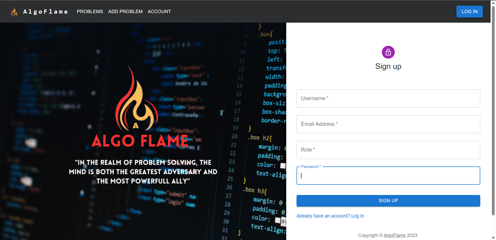
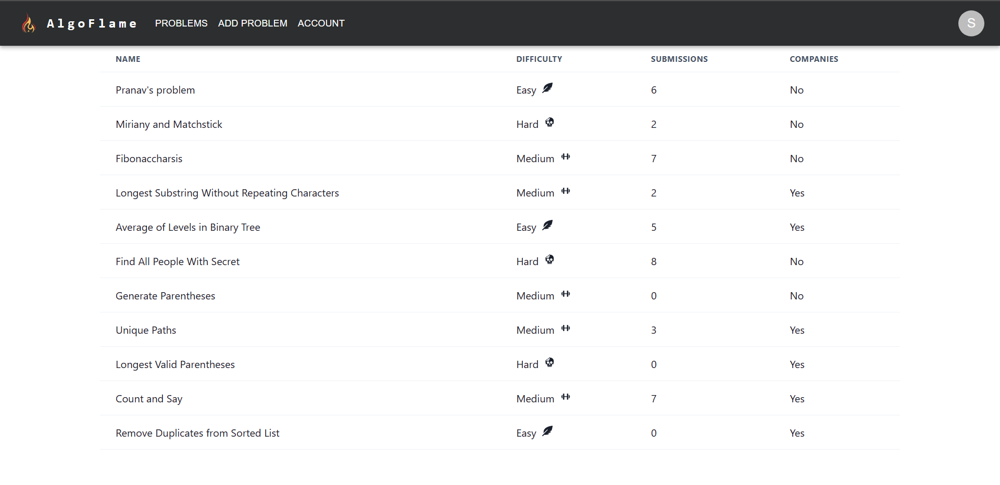
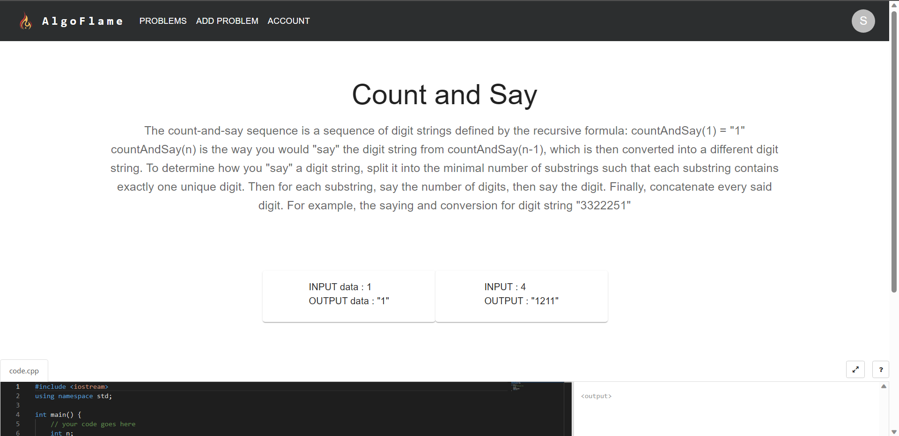
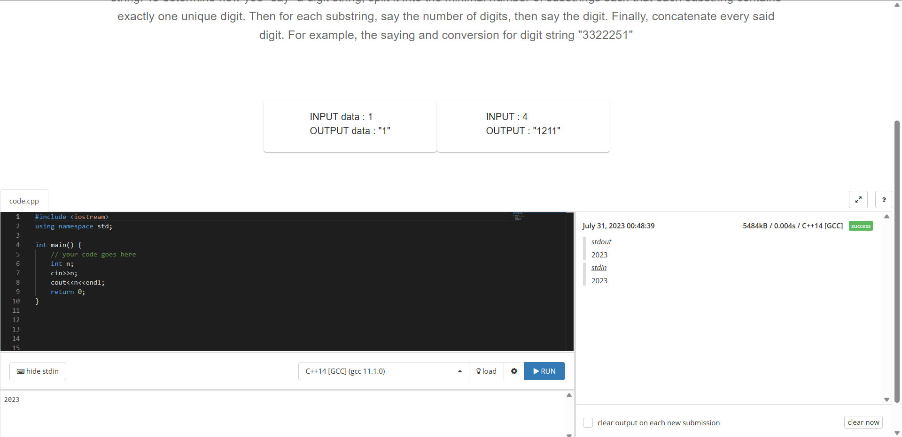

# AlgoFlame - Problem Solving Platform

  

## Overview

Welcome to AlgoFlame, a dynamic platform for honing your problem-solving skills through coding challenges. With AlgoFlame, you can practice coding problems, run and verify your code in multiple languages, and explore a diverse range of problems based on difficulty levels. Whether you are a beginner or a seasoned coder, AlgoFlame has got you covered!

## Features

1. **Code Editor:** Access a powerful code editor that supports multiple programming languages and syntax highlighting for a seamless coding experience.

2. **Code Execution:** Run your code within the platform to check the output and verify your solutions.

3. **Diverse Problems:** Explore a vast collection of coding problems categorized by difficulty levels and submission counts.

4. **Authentication:** Create an account or log in to access personalized features and keep track of your progress.

5. **Admin Privileges:** Certain routes and features are restricted to administrators for managing problems and users.

6. **Admin Problem Management:** Admins can add, edit, and delete coding problems, providing a dynamic and evolving problem set.

## Tech Stack

- **Frontend:** React, Material-UI
- **Backend:** Node.js, Express.js
- **Database:** MongoDB
- **Authentication:** JSON Web Tokens (JWT)

## Installation and Usage

1. **Clone the Repository:** Use `git clone` to get a local copy of AlgoFlame.
2. **Install Dependencies:** Navigate to the project directory and run `npm install`.
3. **Environment Variables:** Initialize the required environment variables.
4. **Start the Frontend:** Launch the development frontend server with `npm start`.
5. **Start the Backend:** Launch the development backend server with `nodemon app.js`.
6. **Explore AlgoFlame:** The app will be available at http://localhost:3000.

## Screenshots

  &nbsp;
  &nbsp;
  &nbsp;
  &nbsp;

## Contributing

Contributions are welcome! If you have ideas or improvements, please submit a pull request.
